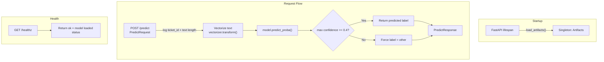

# Stage 3: FastAPI Serving — Plan

## Goal

Create a FastAPI application that serves the trained TF-IDF + LogisticRegression model via REST API with:
- `/predict` endpoint — classify a ticket
- `/healthz` endpoint — health check
- Request logging
- Confidence threshold (label → `"other"` if confidence < 0.4)
- Tests for API contract and edge cases

---

## Architecture



---

## File Changes

### 1. [`schemas.py`](../src/ticket_triage/core/schemas.py) — Add API schemas

Add two new Pydantic models:

```python
class PredictRequest(BaseModel):
    ticket_id: str
    text: str  # reuse existing text_must_be_meaningful validator via TicketIn

class PredictResponse(BaseModel):
    ticket_id: str
    label: str  # "billing" | "bug" | "feature" | "account" | "other"
    confidence: float  # max probability from predict_proba
```

**Trade-off:** `PredictRequest` reuses the same validation as `TicketIn` (min 5 chars, strip whitespace). We can either inherit from `TicketIn` or compose. Composition is cleaner — validate via `TicketIn` inside the endpoint, keep `PredictRequest` as a thin API contract.

**Decision:** Make `PredictRequest` an alias of `TicketIn` (same fields, same validators). No need for a separate class — `TicketIn` already has `ticket_id` + `text` with validation. We just add `PredictResponse`.

### 2. [`app.py`](../src/ticket_triage/api/app.py) — New file, the API

Key design decisions:

- **Singleton artifact loading** via FastAPI `lifespan` context manager (not `@app.on_event` which is deprecated)
- Store artifacts in `app.state.artifacts`
- **Threshold constant** `CONFIDENCE_THRESHOLD = 0.4`
- **Logging** every request: `ticket_id`, `len(text)`, predicted label, confidence

```python
# Pseudocode structure
from contextlib import asynccontextmanager

CONFIDENCE_THRESHOLD = 0.4

@asynccontextmanager
async def lifespan(app: FastAPI):
    # Load model once at startup
    artifacts = load_artifacts(DEFAULT_MODEL_PATH)
    app.state.artifacts = artifacts
    logger.info("Model loaded: %d labels", len(artifacts.labels))
    yield
    # Cleanup if needed

app = FastAPI(lifespan=lifespan)

@app.get("/healthz")
async def healthz():
    return {"status": "ok", "model_loaded": hasattr(app.state, "artifacts")}

@app.post("/predict")
async def predict(request: TicketIn) -> PredictResponse:
    logger.info("Predict request: ticket_id=%s, text_length=%d", request.ticket_id, len(request.text))
    
    artifacts = app.state.artifacts
    X = artifacts.vectorizer.transform([request.text])
    probas = artifacts.model.predict_proba(X)[0]
    max_idx = probas.argmax()
    confidence = float(probas[max_idx])
    label = artifacts.labels[max_idx]
    
    if confidence < CONFIDENCE_THRESHOLD:
        label = "other"
    
    return PredictResponse(ticket_id=request.ticket_id, label=label, confidence=confidence)
```

### 3. Tests

Two test files:

#### `tests/test_api_contract.py` — API contract tests
- `POST /predict` with valid payload → 200, correct schema
- `POST /predict` with empty text → 422 validation error
- `POST /predict` with short text → 422 validation error
- `GET /healthz` → 200, `{"status": "ok", "model_loaded": true}`

#### `tests/test_model_edge_cases.py` — Model edge-case tests
- Gibberish text → model returns a result without crashing
- Very long text → model handles it
- Unicode/emoji text → no crash
- Low-confidence input → label becomes `"other"`

Both use `fastapi.testclient.TestClient` — synchronous, no need for `httpx` async.

**Important:** Tests require `artifacts/model.joblib` to exist. We need to either:
- Run training before tests (CI step)
- Or create a pytest fixture that trains a mini model

**Decision:** Use a `conftest.py` fixture that calls `train_baseline()` to a temp path, then patches the app state. This keeps tests self-contained.

---

## Call Flow: POST /predict

```
Entrypoint (app.py)          Use Case (inline)           Domain (schemas.py)         Infra (artifacts.py)
─────────────────────        ─────────────────           ───────────────────         ────────────────────
POST /predict                                                                        
  │                                                                                  
  ├─ Pydantic validates ──── TicketIn(text=...) ──────── text_must_be_meaningful()   
  │                          strips whitespace,                                      
  │                          rejects < 5 chars                                       
  │                                                                                  
  ├─ Log request ─────────── ticket_id, len(text)                                    
  │                                                                                  
  ├─ Vectorize ──────────────────────────────────────────────────────────────────── artifacts.vectorizer.transform()
  │                                                                                  
  ├─ Predict ────────────────────────────────────────────────────────────────────── artifacts.model.predict_proba()
  │                                                                                  
  ├─ Threshold check ─────── if confidence < 0.4 → "other"                          
  │                                                                                  
  └─ Return PredictResponse                                                          
```

---

## Interfaces That Decouple Layers

| Interface | Defined in | Used by |
|---|---|---|
| [`SklearnPredictor`](../src/ticket_triage/ml/artifacts.py:11) (Protocol) | `artifacts.py` | `app.py` — doesn't care if it's LogisticRegression or SVM |
| [`TicketIn`](../src/ticket_triage/core/schemas.py:11) (Pydantic model) | `schemas.py` | `app.py` — request validation; `train.py` — data cleaning |
| [`Artifacts`](../src/ticket_triage/ml/artifacts.py:19) (dataclass) | `artifacts.py` | `app.py` — singleton state; `train.py` — saves after training |
| [`load_artifacts()`](../src/ticket_triage/ml/artifacts.py:33) / [`save_artifacts()`](../src/ticket_triage/ml/artifacts.py:27) | `artifacts.py` | Swappable: could be replaced with S3/MLflow without touching app.py |

---

## Trade-offs

1. **Sync inference in async endpoint:** `vectorizer.transform()` and `model.predict_proba()` are CPU-bound and fast (< 1ms for TF-IDF + LogReg). Running them synchronously inside an `async def` endpoint is fine. If the model were heavy (e.g., transformer), we'd use `run_in_executor()`.

2. **No separate use-case layer:** The predict logic is simple enough (vectorize → predict → threshold) that extracting it into a separate use-case function adds indirection without value. If business logic grows (e.g., A/B testing, feature flags), extract then.

3. **`"other"` is not in `Label` type:** The threshold mechanism introduces a label that doesn't exist in training data. This is intentional — it's a serving-time safety net, not a model class. `PredictResponse.label` is typed as `str`, not `Label`.

4. **Tests depend on trained model:** Using a fixture that trains to a temp path keeps tests self-contained but adds ~1s to test suite. Acceptable for a small model.
